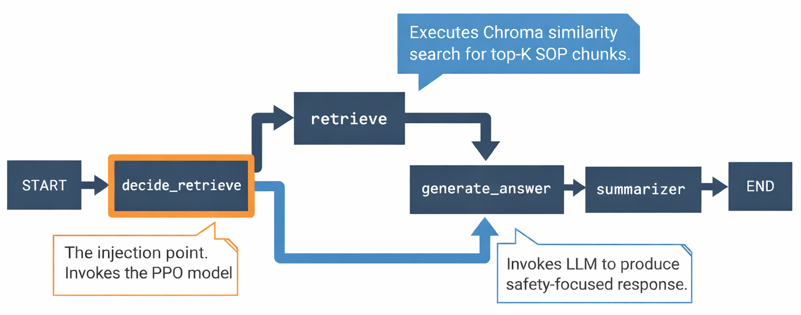
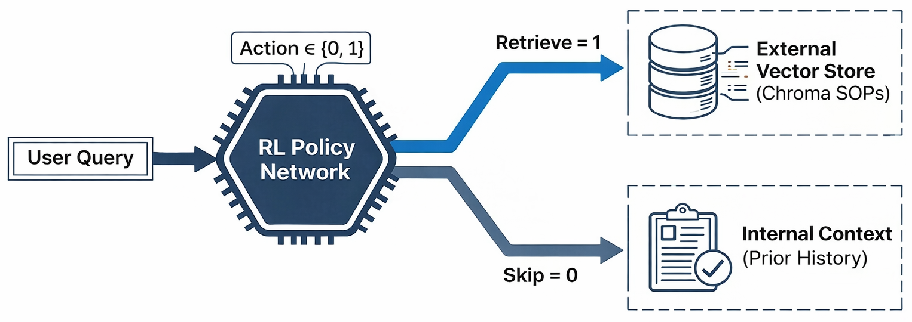
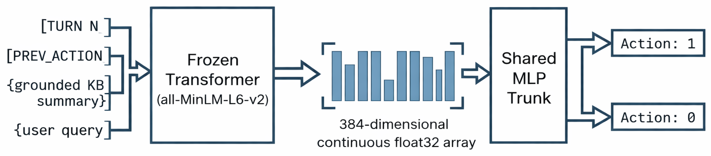
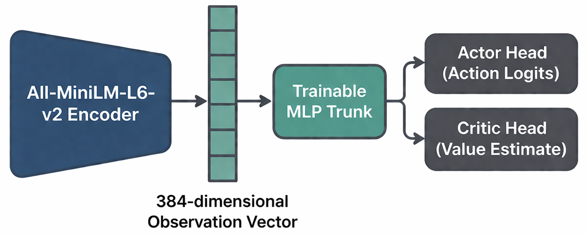

# Disaster-Domain RAG Chatbot with RL-Trained Retrieval Policy

A multi-turn conversational assistant for flood and landslide disaster response in Sri Lanka,
combining Retrieval-Augmented Generation (RAG) with a Reinforcement Learning-trained
retrieval-decision policy.

Built with **LangGraph**, **Stable-Baselines3 (PPO)**, and **Chroma**.

---

## Overview

Conventional RAG pipelines retrieve external knowledge on every conversational turn —
incurring unnecessary latency and token cost even when the required information was already
established in an earlier exchange.

This project trains a lightweight **PPO policy** to make a per-turn binary decision:
**retrieve** new SOP evidence, or **skip** and rely on the accumulated Grounded Knowledge Base.

**Key result:** The RL policy achieves a judge score of **7.84/10** while reducing retrieval
rate to **58.3%** — a 41.7% reduction vs. the always-retrieve baseline — without any increase
in unsafe skip rate.

---

## System Architecture

### Conversational Pipeline



Each user query passes through four stages:

| Stage | What It Does |
|---|---|
| Retrieval Decision | PPO policy (or baseline rule) decides whether to retrieve |
| Retrieval (conditional) | Top-K similarity search against the SOP vector store |
| Answer Generation | LLM constructs response using KB + retrieved chunks |
| KB Update | Grounded Knowledge Base updated with chunk-supported facts only |

### Grounded Knowledge Base

Instead of a conventional conversation summary, the system maintains a **Grounded KB** —
a fact-verified store of SOP-supported knowledge accumulated across turns.

- **Retrieve turns:** Only chunk-supported facts are added. No inference or extrapolation.
- **Skip turns:** KB is preserved unchanged. No new claims introduced.

This allows the judge to correctly award full groundedness credit on skip turns where the
prior KB is sufficient.

---

## RL Framework



### POMDP Formulation



| Component | Definition |
|---|---|
| Observation | 384-dim float32 vector (frozen MiniLM encoder) |
| Action Space | Discrete(2): 0 = skip, 1 = retrieve |
| Reward | `judge_score − β × approx_token_count(retrieved_docs)` |
| Episode | One complete multi-turn conversation |
| Algorithm | PPO with frozen encoder + trainable MLP head |

**Encoder input format:**
```
[TURN N] [SEP] [PREV_ACTION label] [SEP] {grounded KB} [SEP] {user query}
```

### Policy Network



| Layer | Specification |
|---|---|
| Input | float32 (384,) — mean-pooled frozen MiniLM output |
| Shared MLP trunk | Linear(384→256) → ReLU → Linear(256→64) → ReLU |
| Actor head | Linear(64→2) → Categorical distribution |
| Critic head | Linear(64→1) → scalar value V(s) |
| Trainable params | MLP trunk + heads only. Transformer is frozen. |

### Reward Signal
```
reward = judge_score − β × approx_token_count(retrieved_docs)

judge_score ∈ [0, 10]   Quality rating from LLM judge
β = 0.01                Retrieval cost coefficient
token_cost = 0          On skip turns (no docs retrieved)
```

---

## Two-Stage Training Pipeline

### Stage A — Supervised Warm Start

Pre-trains the MLP trunk and actor head as a binary classifier using
`retrieval_required` ground-truth labels from the dataset.

- **Loss:** CrossEntropyLoss(logits, retrieval_required_label)
- **Optimizer:** AdamW, lr=1e-3, batch size=256
- **Early stopping:** patience=5 on validation F1
- **Purpose:** Initializes the actor near a good policy before PPO exploration, substantially
  reducing unsafe skips in early training.

### Stage B — PPO Fine-Tuning

Warm-start actor weights are loaded into the PPO policy. PPO then optimizes the full
reward signal — judge score minus retrieval cost — across the training episode set.

| Hyperparameter | Value |
|---|---|
| Learning rate | 3e-4 |
| n_steps | 512 |
| Batch size | 64 |
| PPO epochs | 10 |
| Entropy coefficient | 0.04 |
| γ (discount) | 0.95 |
| Clip range | 0.2 |
| β (retrieval cost) | 0.01 |

---

## Dataset

A purpose-built annotated dataset of **3,533 episodes** and **20,288 turns**, generated
using GPT-4o-mini via a single-pass generation + annotation pipeline.

| Statistic | Value |
|---|---|
| Total episodes | 3,533 |
| Total turns | 20,288 |
| Avg turns per episode | 5.74 |
| Turns requiring retrieval | 10,854 (53.5%) |
| Turns not requiring retrieval | 9,434 (46.5%) |
| Scenario types | 14 (A through N) |
| Query type categories | 13 |

**14 scenario templates** cover diverse conversational patterns including follow-up
conversations, emergency dialogue, topic shifts, OOD handling, misconception correction,
multi-chunk synthesis, and more.

---

## Evaluation Results

Four strategies evaluated on the same held-out test set:

| Metric | RL Policy | Always-Retrieve | Always-Skip | Heuristic Router |
|---|---|---|---|---|
| Judge Score (/10) | **7.84** | 8.12 | 4.23 | 7.41 |
| Retrieval Rate | 58.3% | 100.0% | 0.0% | 51.2% |
| Unsafe Skip Rate (FN/N) | **0.038** | 0.000 | 0.535 | 0.061 |
| Wasteful Retrieve Rate | 0.124 | 0.465 | 0.000 | 0.187 |
| Routing F1 | **0.812** | 0.677 | 0.000 | 0.743 |
| Routing Accuracy | 0.839 | 0.535 | 0.465 | 0.801 |
| Avg Token Count | 187 | 321 | 0 | 164 |
| Token Savings vs Baseline | **41.7%** | — | — | 48.9% |
| Utility (Q − λC) | **0.597** | 0.491 | 0.423 | 0.578 |

---

## Project Structure
```
├── main.py                    # CLI entry point and chat loop
├── rl_train.py                # PPO training/evaluation CLI
├── core/
│   ├── config.py              # Typed runtime config (AppConfig)
│   ├── prompts.py             # Prompt templates
│   ├── ingestion.py           # Data loading and vectorstore creation
│   ├── nodes.py               # State definition and node logic
│   ├── graph.py               # LangGraph construction
│   └── observability.py       # Langfuse tracing helpers
├── rl_core/
│   ├── state_encoder.py       # Frozen transformer encoder
│   ├── rl_policy.py           # Custom SB3 ActorCriticPolicy
│   ├── rl_env.py              # RAGDecisionEnv (Gymnasium)
│   ├── evaluation.py          # Evaluation runner and metrics
│   ├── plotting.py            # Training and evaluation plots
│   ├── embed_cache.py         # Warm-start embedding cache
│   ├── training_trace.py      # Structured training trace logger
│   └── utils.py               # JudgeChain + utilities
└── dataset_generator/
    ├── chunk_dataset/         # SOP chunk corpus
    └── dialog_dataset/        # Conversation dataset + generation scripts
```

---

## Setup

1. **Install dependencies:**
```bash
pip install -r requirements.txt
```

2. **Configure environment:**
```bash
cp .env.example .env
```

3. **Run the baseline chatbot (always retrieve):**
```bash
python main.py
```

4. **Run with the RL policy:**
```bash
python main.py --mode policy
```

5. **Rebuild the vector store:**
```bash
python main.py --ingest --json dataset_generator/chunk_dataset/chunks_grouped.json
```

---

## Training the RL Policy
```bash
# Full two-stage pipeline (warm start → PPO), 3,000 steps
python rl_train.py --episodes dataset_generator/dialog_dataset/conversations.json --timesteps 3000

# Quick smoke test (~30-40 min)
python rl_train.py --episodes dataset_generator/dialog_dataset/conversations.json --timesteps 500

# Skip warm start (PPO from random init)
python rl_train.py --episodes conversations.json --timesteps 3000 --no-warm-start

# Evaluation only (requires saved policy)
python rl_train.py --episodes conversations.json --eval-only \
    --policy-path policy_checkpoints/best_model.zip
```

**Runtime estimates (CPU):**

| Stage | Time |
|---|---|
| Warm-start encode (first run) | ~35s (cached after → ~1s) |
| Warm-start training (5–15 epochs) | ~2–8 min |
| PPO 500 steps | ~30–40 min |
| PPO 3,000 steps | ~2.5–4 hrs |
| PPO 20,000 steps | ~17–28 hrs |

Monitor training with TensorBoard:
```bash
tensorboard --logdir tb_logs
```

---

## Technical Stack

| Component | Technology |
|---|---|
| Conversational pipeline | LangGraph |
| Language model | OpenAI (gpt-4.1-mini) |
| Embedding model | sentence-transformers/all-MiniLM-L6-v2 (384-dim) |
| Vector store | Chroma (persistent, local) |
| RL algorithm | PPO via Stable-Baselines3 |
| RL environment | Custom Gymnasium (RAGDecisionEnv) |
| Training monitoring | TensorBoard |
| Observability | Langfuse (optional) |
| Dataset generation | GPT-4o-mini |

---

## Tracing

Langfuse tracing is enabled automatically when `LANGFUSE_PUBLIC_KEY` and
`LANGFUSE_SECRET_KEY` are set in your `.env`.